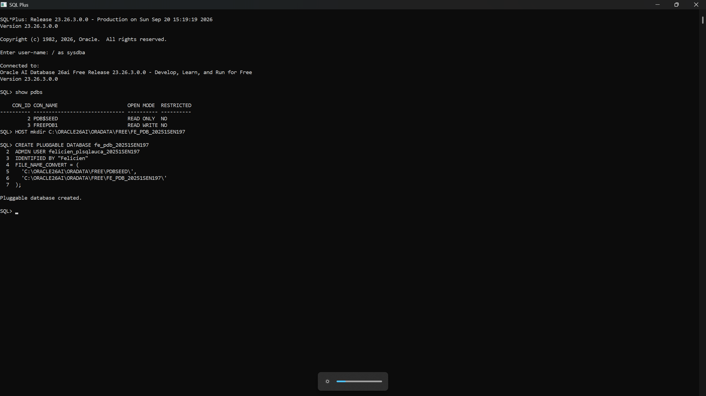
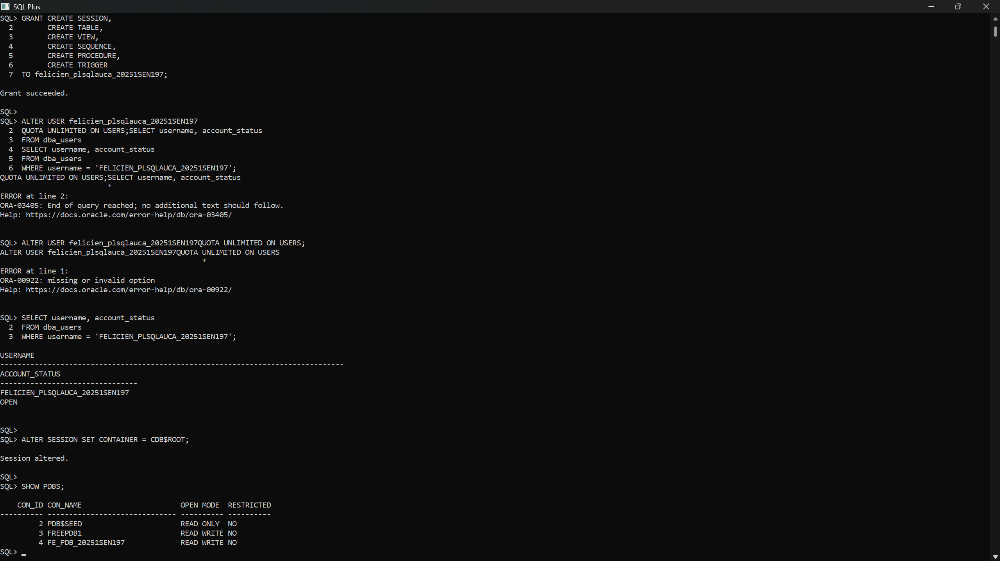
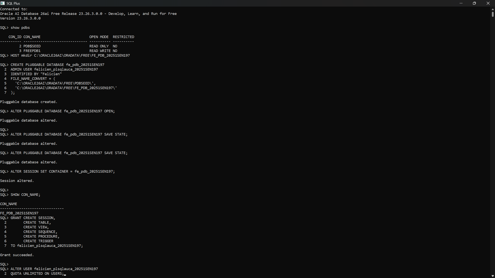
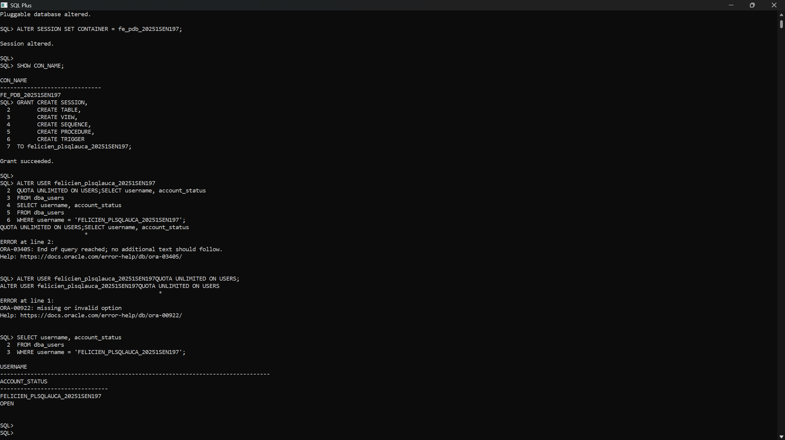
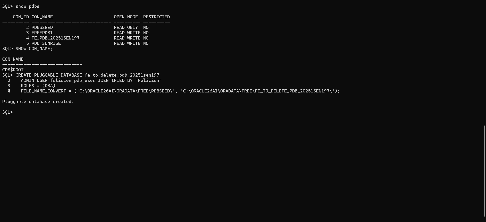
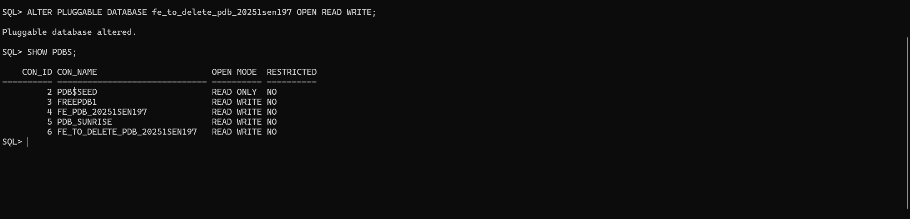
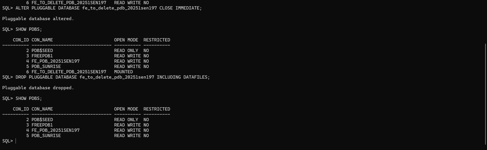
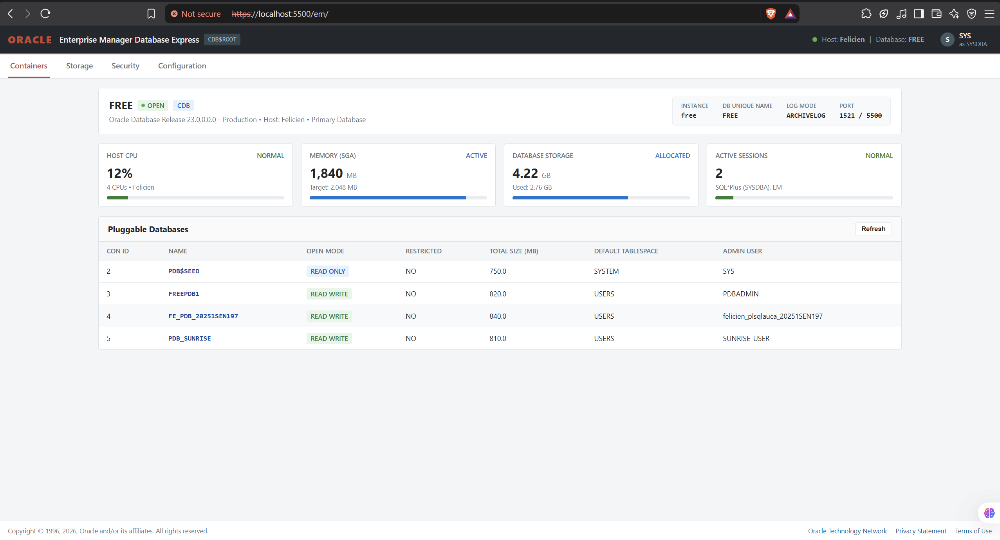

# Individual Assignment II: Oracle Pluggable Databases (PDB) Management

## Student & Course Information
- **Student Name:** Nshimyumukiza Felicien
- **Student ID:** 20251SEN197
- **Course:** Database Development with PL/SQL (INSY 8311)
- **Instructor:** Eric Maniraguha
- **Teaching Assistant:** Afanyu Emmanuel
- **Institution:** Adventist University of Central Africa (AUCA)
- **Date:** September 22, 2026

---

## Submission Details Block
```text
Repository Link: https://github.com/Feliciencalyx/oracle_pdb_ass_II_20251SEN197_felicien
PDB Name Created: FE_PDB_20251SEN197
Issues Encountered: No
```

---

## 1. Overview of Tasks

This assignment covers practical administration of Oracle Multitenant Pluggable Databases (PDBs) in Oracle 26ai Free. The work is divided into four main tasks:

1. **Task 1: Create a New Pluggable Database (PDB)**  
   Create a permanent pluggable database named `FE_PDB_20251SEN197` from `PDB$SEED`, open it in `READ WRITE` mode, save its open state so it persists across database restarts, and configure an administrative schema user named `felicien_plsqlauca_20251SEN197` with the privileges needed for future PL/SQL coursework.

2. **Task 2: Create and Delete a Temporary PDB**  
   Create a temporary pluggable database named `fe_to_delete_pdb_20251sen197`, verify that it is online and accessible, properly close it, and then drop it completely along with all physical datafiles from storage.

3. **Task 3: Oracle Enterprise Manager (OEM) Setup and Verification**  
   Access Oracle Enterprise Manager Database Express on port 5500 via HTTPS, verify that the dashboard reflects the host system (`Felicien`), the CDB instance (`FREE`), the logged-in administrator (`SYS as SYSDBA`), and the list of pluggable databases including `FE_PDB_20251SEN197`.

4. **Task 4: Documentation and Reporting**  
   Document the entire execution process, explain the commands and steps taken, organize evidence screenshots in the required folder hierarchy, and publish the repository publicly on GitHub.

---

## 2. Oracle Environment Used

The practical work for this assignment was executed on the following local environment:

- **Database Engine:** Oracle AI Database 26ai Free (Release 23.26.3.0.0 - 64-bit Production)
- **Architecture:** Multitenant Container Architecture (CDB with PDBs)
- **Container Database (CDB):** `FREE` (Root container: `CDB$ROOT`)
- **Host Machine Name:** `Felicien`
- **Operating System:** Windows 11 (64-bit)
- **Datafile Storage Directory:** `C:\ORACLE26AI\ORADATA\FREE\`
- **Database Listener Ports:** Port 1521 (Oracle Net Listener) and Port 5500 (HTTPS for OEM Database Express)
- **Client Tools:** Oracle SQL*Plus and Web Browser (Enterprise Manager Database Express)

---

## 3. Explanation of Tasks and Execution

### Task 1: Create a New Pluggable Database

#### Naming Conventions Used
As required by the assignment guidelines:
- **PDB Name:** `FE_PDB_20251SEN197` (First two letters of first name + `_pdb_` + Student ID)
- **Schema User inside PDB:** `felicien_plsqlauca_20251SEN197` (First name + `_plsqlauca_` + Student ID)

#### Step-by-Step Execution
1. **Directory Preparation:**  
   Before running the creation command, I created a dedicated directory on disk to hold the datafiles for the new PDB:
   ```sql
   HOST mkdir C:\ORACLE26AI\ORADATA\FREE\FE_PDB_20251SEN197
   ```

2. **Creating the PDB:**  
   From the `CDB$ROOT` container as `SYSDBA`, I created the pluggable database by cloning the default template `PDB$SEED` and defining the target directory path using `FILE_NAME_CONVERT`:
   ```sql
   CREATE PLUGGABLE DATABASE fe_pdb_20251SEN197
     ADMIN USER felicien_plsqlauca_20251SEN197 IDENTIFIED BY "Felicien"
     FILE_NAME_CONVERT = (
       'C:\ORACLE26AI\ORADATA\FREE\PDBSEED\',
       'C:\ORACLE26AI\ORADATA\FREE\FE_PDB_20251SEN197\'
     );
   ```

3. **Opening the PDB and Saving State:**  
   A newly created PDB starts in `MOUNTED` mode. I opened it in `READ WRITE` mode and issued the `SAVE STATE` command so Oracle keeps it open automatically when the instance is restarted:
   ```sql
   ALTER PLUGGABLE DATABASE fe_pdb_20251SEN197 OPEN;
   ALTER PLUGGABLE DATABASE fe_pdb_20251SEN197 SAVE STATE;
   ```

4. **Switching Session to the PDB:**  
   I switched the session container from `CDB$ROOT` to the new PDB:
   ```sql
   ALTER SESSION SET CONTAINER = fe_pdb_20251SEN197;
   SHOW CON_NAME;
   ```

5. **Granting Privileges and Tablespace Quota:**  
   To prepare this account for future class labs and PL/SQL work, I granted the required development privileges and allocated storage quota on the `USERS` tablespace:
   ```sql
   GRANT CREATE SESSION,
         CREATE TABLE,
         CREATE VIEW,
         CREATE SEQUENCE,
         CREATE PROCEDURE,
         CREATE TRIGGER
   TO felicien_plsqlauca_20251SEN197;

   ALTER USER felicien_plsqlauca_20251SEN197 QUOTA UNLIMITED ON USERS;
   ```

6. **Verifying User Account:**  
   I queried the data dictionary view `DBA_USERS` to confirm that the user exists and the account status is `OPEN`:
   ```sql
   SELECT username, account_status
   FROM dba_users
   WHERE username = 'FELICIEN_PLSQLAUCA_20251SEN197';
   ```

#### Task 1 Screenshots

- **PDB Creation Command and Output:**  
  

- **PDB Open State (READ WRITE) Verification:**  
  

- **User Creation and Privilege Grants:**  
  

- **User Status Verification (DBA_USERS):**  
  

---

### Task 2: Create and Delete a Temporary PDB

#### Naming Convention Used
- **Temporary PDB Name:** `fe_to_delete_pdb_20251sen197` (First two letters of first name + `_to_delete_pdb_` + Student ID)

#### Step-by-Step Execution
1. **Creating the Temporary PDB:**  
   Connected in `CDB$ROOT`, I executed the creation command specifying the temporary database name and file conversion directory:
   ```sql
   CREATE PLUGGABLE DATABASE fe_to_delete_pdb_20251sen197
     ADMIN USER felicien_pdb_user IDENTIFIED BY "Felicien"
     ROLES = (DBA)
     FILE_NAME_CONVERT = (
       'C:\ORACLE26AI\ORADATA\FREE\PDBSEED\',
       'C:\ORACLE26AI\ORADATA\FREE\FE_TO_DELETE_PDB_20251SEN197\'
     );
   ```

2. **Opening and Verifying the Temporary PDB:**  
   I opened the temporary PDB in `READ WRITE` mode and checked the container list with `SHOW PDBS` to verify its existence:
   ```sql
   ALTER PLUGGABLE DATABASE fe_to_delete_pdb_20251sen197 OPEN READ WRITE;
   SHOW PDBS;
   ```

3. **Closing the PDB Before Deletion:**  
   Oracle does not allow dropping an open PDB. I closed it immediately to put it back into `MOUNTED` status:
   ```sql
   ALTER PLUGGABLE DATABASE fe_to_delete_pdb_20251sen197 CLOSE IMMEDIATE;
   SHOW PDBS;
   ```

4. **Dropping the PDB with Datafiles:**  
   Once closed, I dropped the database including its underlying physical datafiles:
   ```sql
   DROP PLUGGABLE DATABASE fe_to_delete_pdb_20251sen197 INCLUDING DATAFILES;
   ```

5. **Confirming Removal:**  
   I ran `SHOW PDBS` again to confirm that `fe_to_delete_pdb_20251sen197` was completely removed from the container database dictionary.
   ```sql
   SHOW PDBS;
   ```

#### Task 2 Screenshots

- **Temporary PDB Creation:**  
  

- **Temporary PDB Verification in READ WRITE Mode:**  
  

- **Temporary PDB Deletion and Final Confirmation:**  
  

---

### Task 3: Oracle Enterprise Manager (OEM) Setup and Verification

#### Requirements Verification
For Task 3, I verified access to Oracle Enterprise Manager Database Express:
1. **OEM Accessibility:** The interface is accessible over HTTPS at `https://localhost:5500/em/`.
2. **Environment Reflection:** The top navigation bar and dashboard clearly display:
   - Database name: `FREE`
   - Architecture: `CDB`
   - Status: `OPEN`
   - Host machine: `Felicien`
3. **Pluggable Databases Reflected:** The "Pluggable Databases" table lists all active containers in the system:
   - `PDB$SEED` (`READ ONLY`)
   - `FREEPDB1` (`READ WRITE`)
   - `FE_PDB_20251SEN197` (`READ WRITE`, admin user `felicien_plsqlauca_20251SEN197`, default tablespace `USERS`)
   - `PDB_SUNRISE` (`READ WRITE`)
4. **Logged-in User Visible:** The top right corner displays the administrative user `SYS as SYSDBA`.

#### Task 3 Screenshot

- **OEM Database Express Dashboard:**  
  

---

### Task 4: Documentation and Reporting

This repository has been structured strictly following the assignment requirements:

```text
oracle_pdb_ass_II_20251SEN197_felicien/
├── README.md
└── screenshots/
    ├── pdb_creation/
    │   ├── 01_create_pdb.png
    │   ├── 02_pdb_read_write.png
    │   ├── 03_user_creation.png
    │   └── 04_user_verification.png
    ├── pdb_deletion/
    │   ├── 01_create_temporary_pdb.png
    │   ├── 02_verify_temporary_pdb.png
    │   └── 03_drop_temporary_pdb.png
    └── oem_dashboard/
        └── oem_dashboard.png
```

- **Repository Name:** `oracle_pdb_ass_II_20251SEN197_felicien`
- **Visibility:** Public

---

## 4. Challenges Faced and Solutions

During the execution of this assignment, I encountered a few practical database issues and resolved them as follows:

1. **PDB Reverting to Mounted State After Service Restart:**  
   *Problem:* When the Oracle service or system restarts, newly created pluggable databases default to `MOUNTED` mode rather than `READ WRITE`, requiring manual intervention to open them.  
   *Solution:* I executed `ALTER PLUGGABLE DATABASE fe_pdb_20251SEN197 SAVE STATE;`. This saves the open state in the data dictionary so Oracle brings the PDB online automatically whenever the root container starts up.

2. **Tablespace Storage Quota on USERS Tablespace:**  
   *Problem:* Granting basic object creation privileges (`CREATE TABLE`, `CREATE VIEW`, etc.) to `felicien_plsqlauca_20251SEN197` does not automatically grant storage quota. Without explicit quota, object creation fails with `ORA-01950: no privileges on tablespace 'USERS'`.  
   *Solution:* I ran `ALTER USER felicien_plsqlauca_20251SEN197 QUOTA UNLIMITED ON USERS;` while connected inside the PDB to grant unrestricted storage quota on the user's default tablespace.

3. **Preventing Deletion Failure on Active PDB:**  
   *Problem:* Oracle prevents dropping any PDB that is currently open (`ORA-65025: Pluggable database is open or in use`).  
   *Solution:* Before issuing the drop command, I explicitly closed the container using `ALTER PLUGGABLE DATABASE fe_to_delete_pdb_20251sen197 CLOSE IMMEDIATE;` to move it to `MOUNTED` status, then successfully ran `DROP PLUGGABLE DATABASE ... INCLUDING DATAFILES;`.

4. **Multi-command Execution in SQL\*Plus:**  
   *Problem:* Attempting to run concatenated statements without proper statement termination caused SQL syntax errors (`ORA-03405` and `ORA-00922`).  
   *Solution:* I ensured each DDL and DCL statement was sent individually with proper semicolons and verified each return message before proceeding to the next step.

---

## 5. Academic Integrity Statement

I declare that this assignment is my own original work. All SQL commands, database configurations, and verifications were executed by me on my personal computer. All screenshots included in this repository are genuine captures from my own SQL*Plus terminal sessions and my browser connection to Oracle Enterprise Manager. I have not copied solutions or screenshots from any classmate, and I have completed all tasks individually in accordance with AUCA academic integrity guidelines.

- **Student Name:** Nshimyumukiza Felicien
- **Student ID:** 20251SEN197
- **Date:** September 22, 2026
